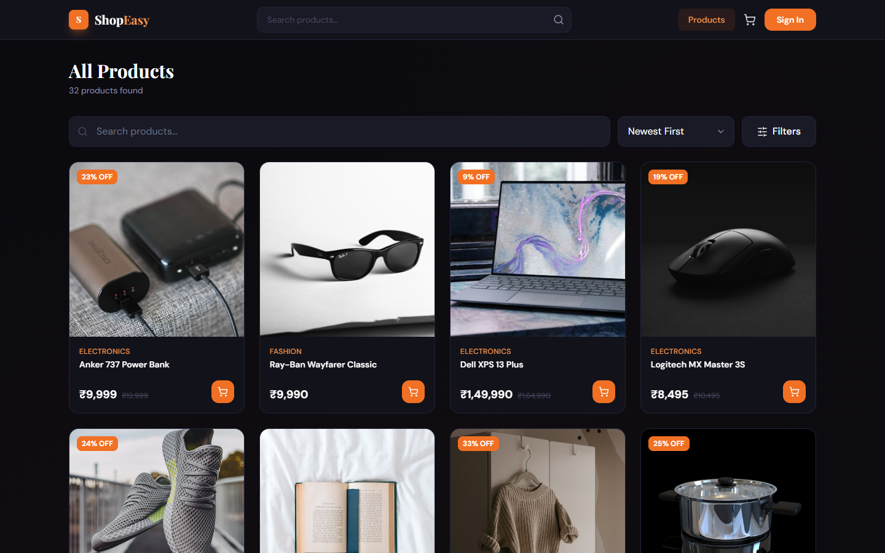
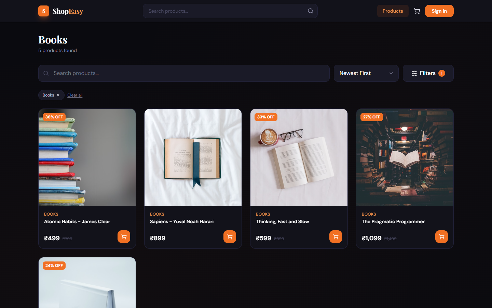
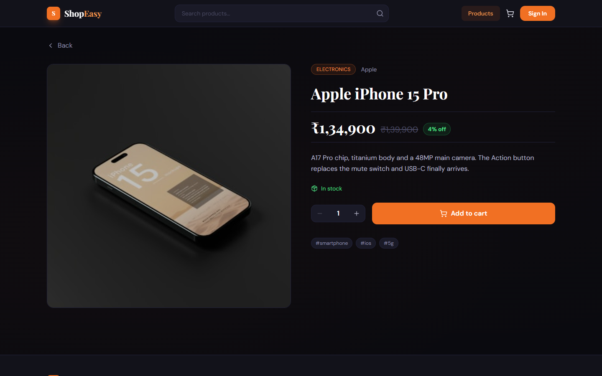
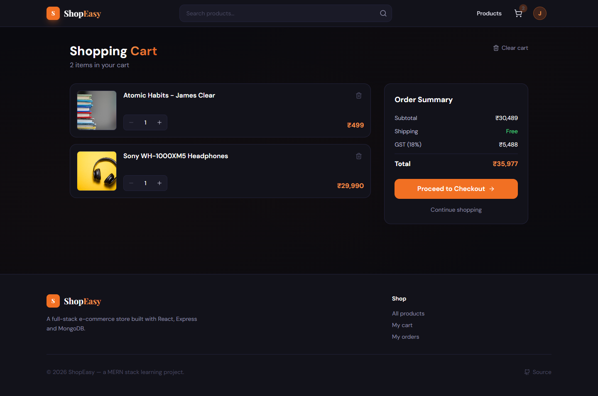
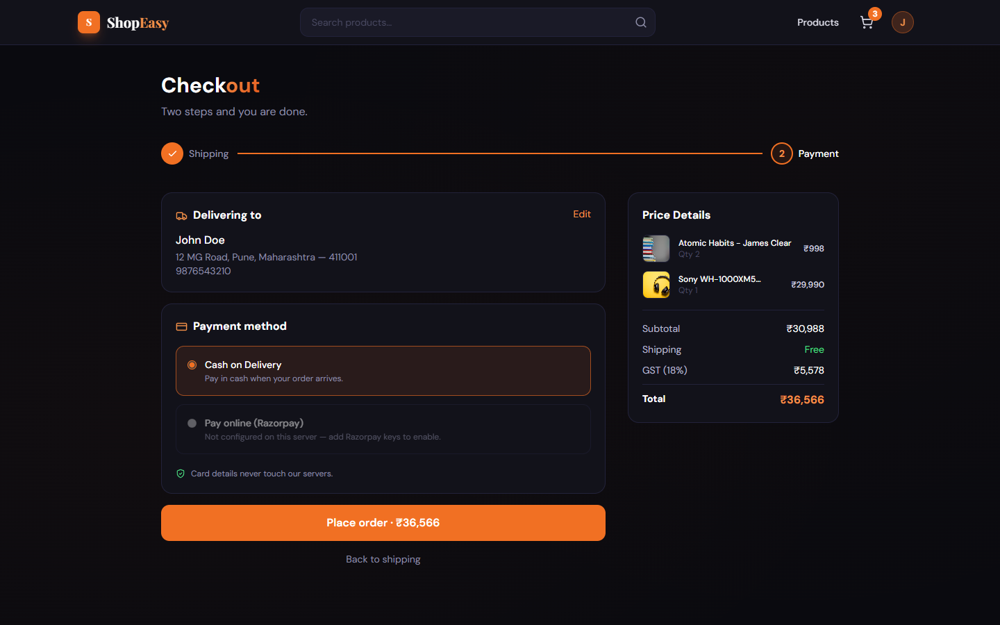
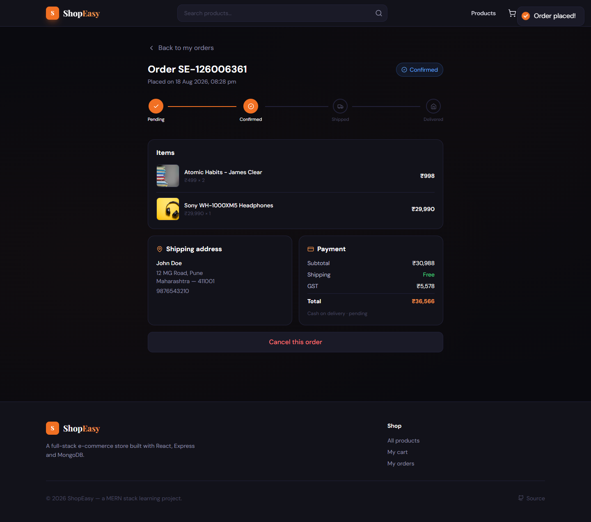
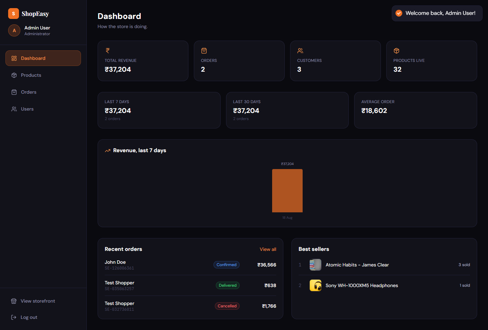
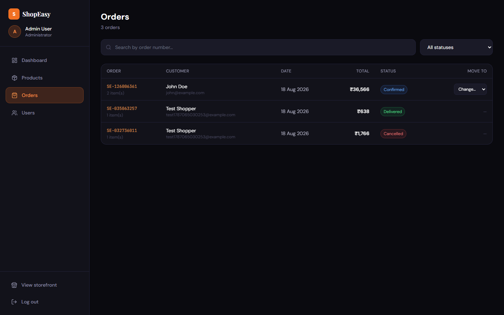
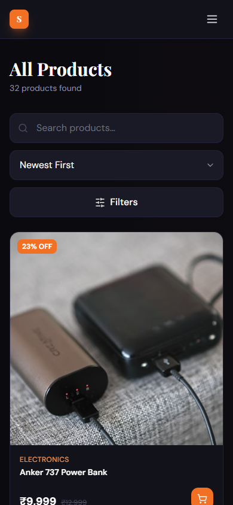

# ShopEasy

A full-stack e-commerce store built with the MERN stack. Customers can browse a
catalogue, search and filter it, build a cart, check out and track their orders.
Admins get a separate area for managing products, stock and order status.

This is a learning project, built to be understood end to end rather than to look
big. It is a **modular monolith**: one React app, one Express API, one MongoDB
database. No microservices, no message queues, no Kubernetes.

---

## Contents

- [Features](#features)
- [Screenshots](#screenshots)
- [Tech stack](#tech-stack)
- [Architecture](#architecture)
- [Folder structure](#folder-structure)
- [Getting started](#getting-started)
- [Environment variables](#environment-variables)
- [Database models](#database-models)
- [API overview](#api-overview)
- [Authentication flow](#authentication-flow)
- [How a request travels through the app](#how-a-request-travels-through-the-app)
- [Design decisions](#design-decisions)
- [Testing](#testing)
- [Limitations](#limitations)
- [Future improvements](#future-improvements)

---

## Features

**Customers**

- Register, log in, log out; session survives a page refresh
- Browse products with server-side search, category and price filters, sorting and pagination
- Search is debounced, so typing sends one request instead of one per keystroke
- Product detail pages reachable by slug (`/products/apple-iphone-15-pro`) or id
- Cart stored in the database, so it follows you between devices
- Quantity limits enforced against real stock
- Two-step checkout with validated address entry
- Cash on delivery, plus optional Razorpay online payment
- Order history, order detail with a status timeline, and cancellation
- Profile editing, password change and a saved address book

**Admins**

- Dashboard with revenue, order counts, a 7-day revenue chart and best sellers
- Full product CRUD, including stock management
- Order list with status filter and search, and a status workflow
- User list with the ability to deactivate an account

**Throughout**

- Loading skeletons, empty states and error states on every list
- Consistent JSON error responses with per-field validation messages
- Responsive layouts down to a phone, including the admin area

---

## Screenshots

| | |
|---|---|
| **Home** — featured products and categories | **Products** — search, filters, sorting, pagination |
|  |  |
| **Category** — filtered, chip removable | **Product detail** — reachable by slug |
|  |  |
| **Cart** — server-side, stock-aware | **Checkout** — address review and payment |
|  |  |
| **Order** — status timeline and breakdown | **Admin dashboard** — aggregated stats |
|  |  |
| **Admin orders** — enforced status workflow | |
|  | |

The layout works down to a phone, admin area included:



---

## Tech stack

| Layer     | Choice                              | Why |
|-----------|-------------------------------------|-----|
| Frontend  | React 18 + Vite                     | Component model fits a catalogue UI; Vite gives fast startup and HMR |
| Routing   | React Router 6                      | Nested routes let one guard protect a whole group of pages |
| Styling   | Tailwind CSS                        | Styles live next to the markup; no separate CSS files to keep in sync |
| State     | Context API (auth + cart)           | Only two things are truly global; Redux would be more setup than the app needs |
| HTTP      | Axios                               | Interceptors attach the JWT and normalise errors in one place |
| Backend   | Node.js + Express                   | Small, unopinionated, and the same language as the frontend |
| Database  | MongoDB + Mongoose                  | Products vary in shape; schemas and validation come from Mongoose |
| Auth      | JWT (`jsonwebtoken`) + `bcryptjs`   | Stateless tokens, so the API keeps no session store |
| Validation| `express-validator`                 | Rules sit on the route, separate from controller logic |
| Security  | `helmet`, `express-rate-limit`, CORS| Sensible defaults without much configuration |

---

## Architecture

```
Browser (React SPA)
      |
      |  JSON over HTTP  (Axios, JWT in the Authorization header)
      v
Express API
      |
      |  routes -> validation -> auth middleware -> controller
      v
Mongoose models
      |
      v
MongoDB (Atlas or local)
```

Every request follows the same path through the backend:

```
Route          picks the handler and lists the validation rules
  |
Validation     express-validator checks the body/params/query
  |
protect        verifies the JWT and loads req.user
  |
authorize      checks the role for admin-only routes
  |
Controller     the actual work; talks to models
  |
Model          Mongoose schema, hooks and validation
  |
MongoDB
  |
Response       { success, message, data } - or the error handler takes over
```

There is exactly one error handler and one response shape. Controllers never
build their own error JSON: they call `next(createError(message, status))` or
throw, and `middleware/errorMiddleware.js` turns that into a response.

---

## Folder structure

```
shopeasy/
├── backend/
│   ├── config/
│   │   └── db.js                 MongoDB connection
│   ├── controllers/              request handling and business logic
│   │   ├── authController.js     register, login, profile, addresses
│   │   ├── productController.js  catalogue queries and admin CRUD
│   │   ├── cartController.js     cart reads and mutations
│   │   ├── orderController.js    placing, listing, cancelling orders
│   │   ├── paymentController.js  Razorpay order creation and verification
│   │   └── adminController.js    dashboard aggregations, user management
│   ├── middleware/
│   │   ├── authMiddleware.js     protect (verify JWT) / authorize (check role)
│   │   ├── errorMiddleware.js    404 handler + the single error handler
│   │   ├── validate.js           turns validation failures into API errors
│   │   └── validators.js         the express-validator rule sets
│   ├── models/                   Mongoose schemas
│   │   ├── User.js  Product.js  Category.js  Cart.js  Order.js
│   ├── routes/                   URL -> middleware -> controller
│   ├── utils/
│   │   ├── apiError.js           createError helper
│   │   ├── apiResponse.js        successResponse / paginatedResponse
│   │   ├── pricing.js            shipping and tax rules (single source of truth)
│   │   └── seeder.js             fills an empty database with demo data
│   ├── tests/
│   │   ├── e2e.js                end-to-end check of every flow
│   │   └── route-map.js          frontend calls vs. real routes
│   └── server.js                 app setup, middleware order, startup
│
└── frontend/
    └── src/
        ├── components/
        │   ├── common/           Navbar, Footer, Pagination, EmptyState, spinner
        │   └── product/          ProductCard, ProductCardSkeleton
        ├── context/
        │   ├── AuthContext.jsx   who is logged in
        │   └── CartContext.jsx   cached copy of the server-side cart
        ├── hooks/
        │   ├── useDebounce.js    holds back fast-changing values
        │   └── useClickOutside.js closes dropdowns
        ├── layouts/
        │   ├── MainLayout.jsx    navbar + page + footer
        │   └── AdminLayout.jsx   admin sidebar
        ├── pages/                one file per screen (admin pages in pages/admin)
        ├── routes/
        │   ├── ProtectedRoute.jsx must be logged in
        │   └── AdminRoute.jsx     must be an admin
        ├── services/             every API call in the app lives here
        │   ├── api.js            axios instance + interceptors
        │   └── authService.js productService.js cartService.js
        │       orderService.js adminService.js
        ├── utils/
        │   ├── format.js         currency, dates, product image/price helpers
        │   ├── pricing.js        mirrors the backend pricing rules
        │   └── orderStatus.js    the order lifecycle in one place
        ├── App.jsx               the route table
        └── main.jsx              providers and app mount
```

**Why services/ exists:** pages never call axios directly. They call
`productService.list(...)`, which knows the URL and the response shape. When the
API changes, one file changes instead of ten pages.

---

## Getting started

**Requirements:** Node.js 18+ and a MongoDB database (local, or a free Atlas cluster).

### 1. Backend

```bash
cd backend
npm install
cp .env.example .env        # then fill in MONGODB_URI and JWT_SECRET
npm run seed                # creates categories, 12 products and two accounts
npm run dev                 # http://localhost:5000
```

The seeder prints the demo logins:

| Role     | Email                 | Password       |
|----------|-----------------------|----------------|
| Admin    | admin@shopeasy.com    | Admin@123      |
| Customer | john@example.com      | Password@123   |

### 2. Frontend

```bash
cd frontend
npm install
cp .env.example .env        # the default API URL is usually fine
npm run dev                 # http://localhost:5173
```

### Available scripts

| Where    | Command            | What it does |
|----------|--------------------|--------------|
| backend  | `npm run dev`      | Starts the API with nodemon |
| backend  | `npm start`        | Starts the API with node |
| backend  | `npm run seed`     | Wipes and refills the database |
| backend  | `npm run test:e2e` | Runs the end-to-end flow check (API must be running) |
| backend  | `npm run test:routes` | Checks every frontend API call against the real route table |
| frontend | `npm run dev`      | Vite dev server |
| frontend | `npm run build`    | Production build into `dist/` |
| frontend | `npm run lint`     | ESLint over `src/` |

---

## Environment variables

**backend/.env**

| Variable | Required | Notes |
|----------|----------|-------|
| `PORT` | no | Defaults to 5000 |
| `NODE_ENV` | no | `development` shows stack traces on 500s |
| `MONGODB_URI` | **yes** | Server refuses to start without it |
| `JWT_SECRET` | **yes** | Any long random string. Server refuses to start without it |
| `JWT_EXPIRE` | no | Defaults to `7d` |
| `FRONTEND_URL` | no | CORS origin. Defaults to `http://localhost:5173` |
| `RAZORPAY_KEY_ID` / `RAZORPAY_KEY_SECRET` | no | Leave as the placeholders to run cash-on-delivery only |
| `ADMIN_EMAIL` / `ADMIN_PASSWORD` | no | Used by the seeder |

**frontend/.env**

| Variable | Notes |
|----------|-------|
| `VITE_API_URL` | Defaults to `http://localhost:5000/api` |

`.env` files are gitignored. Only `.env.example` is committed.

---

## Database models

### User
`name`, `email` (unique), `password` (hashed, `select: false`), `role`
(`customer` | `admin`), `phone`, `avatar`, `addresses[]`, `isActive`, `lastLogin`

- A `pre("save")` hook hashes the password with bcrypt, but only when the password
  actually changed — otherwise editing a profile would re-hash the hash.
- `select: false` means the password is never returned unless a query explicitly
  asks for it, which only the login and change-password paths do.
- `toPublicJSON()` is what gets sent to the client.

### Category
`name` (unique), `slug`, `description`, `image`, `isActive`. The slug is generated
from the name before saving.

### Product
`name`, `slug` (unique), `description`, `shortDescription`, `price`,
`discountedPrice`, `category` (ref), `brand`, `images[]`, `stock`, `tags[]`,
`isFeatured`, `isActive`, `reviews[]`, `rating`, `numReviews`

- `discountedPrice: 0` means "no offer running". The `effectivePrice` virtual
  resolves which price applies.
- Deleting is a soft delete (`isActive: false`), because past orders still refer
  to the product.

### Cart
One document per user (`user` is unique), holding `items[]` of
`{ product, quantity, price, name, image }`.

The name, price and image are copied in at add time, so the cart still renders if
a product later disappears. Prices are re-read from the product on every read, so
the customer always sees the current price.

### Order
`user`, `orderNumber` (unique), `items[]`, `shippingAddress`, `paymentMethod`,
`payment{}`, `pricing{}`, `status`, `statusHistory[]`, timestamps

Order items are a **snapshot**, not a reference to live product data. If a price
changes tomorrow, an order placed today must still show what was actually paid.

**Indexes and why they exist**

| Index | Serves |
|-------|--------|
| `Product { isActive, category, price }` | The product list always filters on `isActive` and usually narrows by category or price |
| `Product { isActive, isFeatured }` | The homepage featured strip |
| `Product { slug }` (unique) | Looking a product up from its URL |
| `User { email }` (unique) | Every login |
| `Order { user, createdAt }` | Order history, which is always "this user, newest first" |
| `Order { status }` | The admin order filter |

Nothing is indexed just to be able to say the word "index". Fields nobody queries
by have no index.

---

## API overview

Base URL: `http://localhost:5000/api`

Every response looks like:

```json
{ "success": true, "message": "…", "data": { } }
```

Errors look like:

```json
{ "success": false, "message": "Validation failed",
  "errors": [{ "field": "email", "message": "Enter a valid email" }] }
```

Lists add a `pagination` object with `currentPage`, `totalPages`, `totalItems`,
`itemsPerPage`, `hasNextPage`, `hasPrevPage`.

| Method | Endpoint | Access | Purpose |
|--------|----------|--------|---------|
| POST | `/auth/register` | public | Create an account, returns a JWT |
| POST | `/auth/login` | public | Log in, returns a JWT |
| GET | `/auth/me` | user | Who owns this token |
| PUT | `/auth/profile` | user | Update name / phone |
| PUT | `/auth/change-password` | user | Change password, returns a fresh token |
| POST/PUT/DELETE | `/auth/address[/:id]` | user | Address book |
| GET | `/products` | public | Search, filter, sort, paginate |
| GET | `/products/featured` | public | Homepage strip |
| GET | `/products/:identifier` | public | By id or slug |
| POST/PUT/DELETE | `/products[/:id]` | **admin** | Product CRUD |
| POST | `/products/:id/reviews` | user | Leave a review |
| GET | `/categories` | public | Category list |
| GET | `/cart` | user | Current cart |
| POST | `/cart/add` | user | Add an item |
| PUT | `/cart/update` | user | Change a quantity |
| DELETE | `/cart/remove/:productId` | user | Remove an item |
| DELETE | `/cart/clear` | user | Empty the cart |
| POST | `/orders` | user | Turn the cart into an order |
| GET | `/orders/my-orders` | user | Order history |
| GET | `/orders/:id` | user (owner) | Order detail |
| PUT | `/orders/:id/cancel` | user (owner) | Cancel, restores stock |
| GET | `/orders/admin/all` | **admin** | All orders |
| PUT | `/orders/:id/status` | **admin** | Move an order along |
| GET | `/admin/dashboard` | **admin** | Aggregated stats |
| GET | `/admin/users` | **admin** | User list |
| PUT | `/admin/users/:id/toggle-status` | **admin** | Activate / deactivate |
| GET | `/payment/config` | user | Is online payment switched on |
| POST | `/payment/create-order` | user | Create a Razorpay order |
| POST | `/payment/verify` | user | Verify the signature, confirm the order |

Query parameters for `GET /products`:
`search`, `category`, `minPrice`, `maxPrice`, `brand`, `featured`, `page`,
`limit` (max 50), `sort` (`newest`, `price-asc`, `price-desc`, `rating`, `name`).

Full details in [API_DOCS.md](API_DOCS.md).

---

## Authentication flow

```
1. User submits the login form
2. POST /api/auth/login
3. Backend finds the user and compares the password with bcrypt.compare()
4. On success it signs a JWT: { id, role, email }, expires in 7 days
5. Frontend stores the token and the user in localStorage, and in AuthContext state
6. The axios request interceptor adds "Authorization: Bearer <token>" to every request
7. protect() verifies the signature, loads the user from the database, sets req.user
8. authorize("admin") checks req.user.role on admin routes
```

Two details worth knowing:

**localStorage is a cache, not the source of truth.** On every page load,
`AuthContext` calls `GET /auth/me` with the stored token. If the token has
expired or the account was deactivated, the stored session is thrown away. Without
this, editing localStorage by hand would appear to log you in.

**Route guards are convenience, not security.** `ProtectedRoute` and `AdminRoute`
only decide what to render. Anyone can bypass them with devtools, which is why
every protected API route checks the token and role again on the server.

---

## How a request travels through the app

Taking "add to cart" end to end:

1. `ProductCard.jsx` calls `addToCart(product._id)` from `CartContext`
2. `CartContext` calls `cartService.add(productId, quantity)`
3. `cartService` calls `api.post('/cart/add', …)`; the interceptor attaches the JWT
4. Express matches `POST /api/cart/add` in `routes/cartRoutes.js`
5. `cartAddRules` validate the body; `validate` rejects it with 422 if anything is off
6. `protect` verifies the token and sets `req.user`
7. `cartController.addToCart` checks the product exists, is active and has stock
8. Mongoose saves the cart document
9. `sendCart()` reads the cart back, populated, and returns the whole thing
10. `CartContext` replaces its state with the response — the navbar badge and the
    cart page both update, because they read the same context

---

## Design decisions

**The cart lives on the server.** A localStorage cart is simpler, but it does not
follow the user to another device, and it can be edited in devtools to change
prices. Storing it in MongoDB means prices and stock are checked by code the user
cannot touch.

**Order items are copied, not referenced.** An order stores the name, image and
price of what was bought. Referencing the product would mean an old order silently
changes when a price changes.

**Search uses a regex, not a text index.** A MongoDB text index only matches whole
words, so typing "iph" would find nothing — bad for a search-as-you-type box. A
case-insensitive regex gives substring matching, which is what the UI needs. The
trade-off is that an unanchored regex cannot use an index, so this would need to
become Atlas Search or Elasticsearch at a much larger catalogue size.

**Sorting is whitelisted.** `?sort=` maps to a fixed set of options rather than
being passed to Mongo directly, so the query string cannot ask the database to
sort by arbitrary fields.

**Pricing lives in one place.** `backend/utils/pricing.js` is the source of truth
for shipping and GST. `frontend/src/utils/pricing.js` mirrors it purely so the cart
can show a breakdown before an order exists. The order always stores what the
backend calculated.

**Placing an order claims the cart atomically.**

```js
const claimedCart = await Cart.findOneAndUpdate(
  { user: req.user._id, "items.0": { $exists: true } },
  { $set: { items: [] } }
);
```

This reads the items and empties the cart in a single operation. If the user
double-clicks "Place order", only the first request gets items back; the second
finds an empty cart and is rejected. Duplicate-order protection with no extra
bookkeeping.

**Stock is decremented conditionally.**

```js
await Product.findOneAndUpdate(
  { _id, isActive: true, stock: { $gte: quantity } },
  { $inc: { stock: -quantity } }
);
```

The check and the decrement happen in one atomic update, so two people buying the
last unit cannot both succeed. If a later item in the same order fails, the stock
already taken is given back and the cart is restored.

**Online payment is optional.** The repo ships with placeholder Razorpay keys.
Rather than failing halfway through a checkout, the backend reports
`onlinePaymentEnabled: false` and the checkout page only offers cash on delivery.
Add real keys and the online option appears.

**Context instead of Redux.** Only two things are genuinely global: who is logged
in, and what is in the cart. Everything else is page-local state. Redux would add
a store, actions and reducers for two values.

---

## Testing

`backend/tests/e2e.js` walks the whole application through the API — registration,
login, browsing, search, sorting, pagination, cart limits, checkout, stock
changes, cancellation, admin CRUD, the order lifecycle and the authorization rules
that should refuse each of them.

```bash
cd backend
npm run dev          # in one terminal
npm run test:e2e     # in another
```

It prints a pass/fail line per check and exits non-zero if anything fails.

`backend/tests/route-map.js` is a smaller, separate check: it reads every URL the
frontend service layer calls and every route Express actually registers, and
reports any call that has no matching route.

```bash
npm run test:routes     # does not need the server running
```

This catches a whole class of bug that a build will not — the frontend compiling
perfectly while calling an endpoint that does not exist.

---

## Limitations

Worth being upfront about:

- **No image upload.** Products take an image URL. Real uploads would need
  Cloudinary or S3 plus multer wiring.
- **No email.** No order confirmations, no password reset.
- **JWT in localStorage.** Simple and common, but readable by any script that
  gets onto the page. httpOnly cookies would be safer; they need CSRF handling.
- **No refresh tokens.** A token lasts 7 days and then you log in again.
- **Search does not scale.** See the regex note above.
- **No automated frontend tests.** The e2e script covers the API only.
- **Single admin role.** No finer-grained permissions.
- **Removed products cannot be restored from the UI.** Deleting is a soft delete,
  so order history stays intact, but the admin product list reads the public
  endpoint, which only returns active products. Restoring means flipping
  `isActive` in the database. A "removed products" screen would be the next step.
- **Reviews are not purchase-verified.** Any logged-in user can review anything.

## Future improvements

Roughly in the order they would matter:

1. Image upload to Cloudinary
2. Order confirmation emails
3. Move the JWT into an httpOnly cookie, add refresh tokens
4. Frontend tests with Vitest and React Testing Library
5. Wishlist and product comparison
6. Coupon codes (the `discount` field on orders already exists)
7. Restrict reviews to people who actually bought the item

### If traffic grew 100x

Nothing below is implemented — this is what would come next, in order:

1. **Measure first.** Add logging and APM to find the actual slow path.
2. **Index and cache.** Cache the product list and categories in Redis; they are
   read constantly and change rarely.
3. **Scale horizontally.** The API is stateless (JWT, no server sessions), so it
   can run behind a load balancer as several instances without changes.
4. **Move search out.** Atlas Search or Elasticsearch instead of regex.
5. **Serve images from a CDN** rather than hotlinking.
6. **Read replicas** once reads clearly dominate writes.
7. **Split services only if a specific part becomes the bottleneck** — and not
   before, because a monolith this size is easier to run and reason about.
